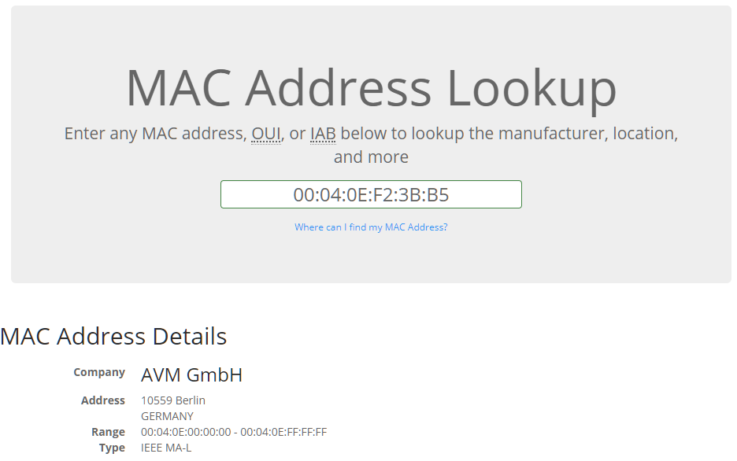
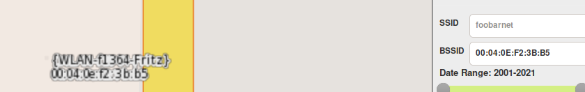

# Wigly Wigly Wack
> See what u can find with this 00:04:0E:F2:3B:B5

Initially I though this was a MAC address so my first thought was to check the vendor.

This doesn't seem like its going to lead anywhere though so I quickly gave upon this.

After reviewing the title of the challenge I realized this was most likely a BSSID. So the next step was to load up [WiGLE](https://wigle.net/) and enter my the BSSID.

And just like that we have our flag:

`HACSEC{WLAN-f1364-Fritz}`
