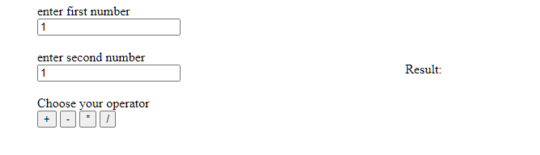

# D4m4ged C4lc
> This calculator does more than javascript operation
Check out for errors
https://hidden-journey-18965.herokuapp.com/

This time the landing page is a basic calculator program:

The calculator doesn't exactly work and is pretty buggy however the user doesn't see any errors on the acctual page.

Lets open dev tools and check the network tab for some more information.

Here we can see that each operator button submits a post request and the response for each of them is `error <no.> -> <string>`. At first glance these error codes seem to be gibberish. However, combining all four together gives us a base64 string `SEFDU0VDe2M0bGNfMypQbDBpdDNkfQ==`, the main giveaway is the double equal sign `==` at the end. This translates to our flag:

`HACSEC{c4lc_3*Pl0it3d}`
