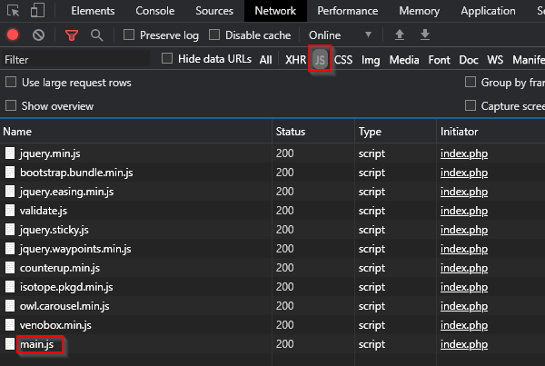
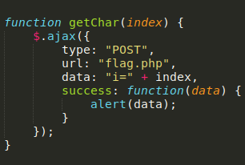
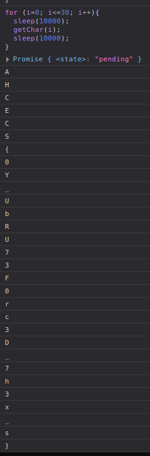
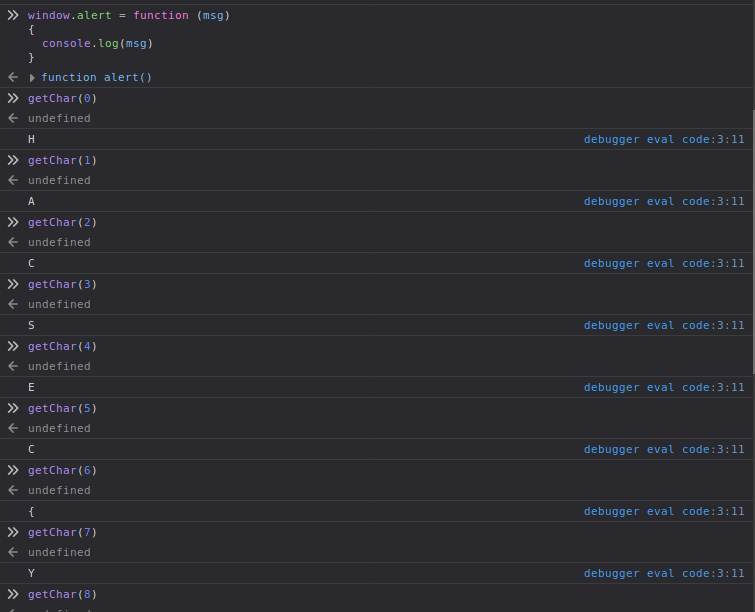

# Eks-Ess-Ess
> The Author has hidden a method to get the flag.
http://35.192.69.102/index.php

Navigating to the page we get a modern blog template:


We could enumerate and try and find some information, however judging by the brief we got we should probably look for js file with the method that they talk about. The best and easiest way to do this is refresh the page and look at the network tab to see what js files are loaded:



Of these files `main.js` is the only interesting as the others all look like default files from various dependencies. At the end of `main.js` there's an interesting looking function `getChar(index)`:



Looking at this method it appears to take in an integer, then creates an alert with the flag's character at that index.
For convenience I changed `window.alert()` to just `console.log()` the message instead like so:
```js
window.alert = function(msg){
  console.log(msg)
}
```

Initially I tried looping through all integers from 0 - 50 and using that as the index in the getChar() method. However this kept returning values out of order, I'm guessing as the server may not have been able to keep up with the speed of the requests so it buffered some of them then sent them back out of order. I'm not an expert on this stuff so I'm just guessing.

I also tried implementing a sleep()(that I found [here](https://flaviocopes.com/javascript-sleep/)) function of 10000ms on either side of the function call to prevent this, however the problem persisted. Here's the code for the loop, and sleep():

```js
const sleep = (milliseconds) => {
  return new Promise(resolve => setTimeout(resolve, milliseconds))
}
```
```js
for (i=0; i<=30; i++){
  sleep(10000);
  getChar(i);
  sleep(10000);
}
```

This is the problem:



So I ended up getting the flag manually, then using cyberchef to trim and replace the junk around the flag:



[flag](https://gchq.github.io/CyberChef/#recipe=Find_/_Replace(%7B'option':'Regex','string':'debugger%20eval%20code:3:11%5C%5CngetChar%5C%5C(.%5C%5C)%5C%5Cnundefined%5C%5Cn'%7D,'',true,true,true,true)Find_/_Replace(%7B'option':'Regex','string':'%20debugger%20eval%20code:3:11%5C%5CngetChar%5C%5C(..%5C%5C)%5C%5Cnundefined%5C%5Cn'%7D,'',true,false,true,false)Find_/_Replace(%7B'option':'Regex','string':'%20'%7D,'',true,true,true,true)&input=SCBkZWJ1Z2dlciBldmFsIGNvZGU6MzoxMQpnZXRDaGFyKDEpCnVuZGVmaW5lZApBIGRlYnVnZ2VyIGV2YWwgY29kZTozOjExCmdldENoYXIoMikKdW5kZWZpbmVkCkMgZGVidWdnZXIgZXZhbCBjb2RlOjM6MTEKZ2V0Q2hhcigzKQp1bmRlZmluZWQKUyBkZWJ1Z2dlciBldmFsIGNvZGU6MzoxMQpnZXRDaGFyKDQpCnVuZGVmaW5lZApFIGRlYnVnZ2VyIGV2YWwgY29kZTozOjExCmdldENoYXIoNSkKdW5kZWZpbmVkCkMgZGVidWdnZXIgZXZhbCBjb2RlOjM6MTEKZ2V0Q2hhcig2KQp1bmRlZmluZWQKeyBkZWJ1Z2dlciBldmFsIGNvZGU6MzoxMQpnZXRDaGFyKDcpCnVuZGVmaW5lZApZIGRlYnVnZ2VyIGV2YWwgY29kZTozOjExCmdldENoYXIoOCkKdW5kZWZpbmVkCjAgZGVidWdnZXIgZXZhbCBjb2RlOjM6MTEKZ2V0Q2hhcig5KQp1bmRlZmluZWQKVSBkZWJ1Z2dlciBldmFsIGNvZGU6MzoxMQpnZXRDaGFyKDEwKQp1bmRlZmluZWQKXyBkZWJ1Z2dlciBldmFsIGNvZGU6MzoxMQpnZXRDaGFyKDExKQp1bmRlZmluZWQKYiBkZWJ1Z2dlciBldmFsIGNvZGU6MzoxMQpnZXRDaGFyKDEyKQp1bmRlZmluZWQKUiBkZWJ1Z2dlciBldmFsIGNvZGU6MzoxMQpnZXRDaGFyKDEzKQp1bmRlZmluZWQKVSBkZWJ1Z2dlciBldmFsIGNvZGU6MzoxMQpnZXRDaGFyKDE0KQp1bmRlZmluZWQKNyBkZWJ1Z2dlciBldmFsIGNvZGU6MzoxMQpnZXRDaGFyKDE1KQp1bmRlZmluZWQKMyBkZWJ1Z2dlciBldmFsIGNvZGU6MzoxMQpnZXRDaGFyKDE2KQp1bmRlZmluZWQKRiBkZWJ1Z2dlciBldmFsIGNvZGU6MzoxMQpnZXRDaGFyKDE3KQp1bmRlZmluZWQKMCBkZWJ1Z2dlciBldmFsIGNvZGU6MzoxMQpnZXRDaGFyKDE4KQp1bmRlZmluZWQKciBkZWJ1Z2dlciBldmFsIGNvZGU6MzoxMQpnZXRDaGFyKDE5KQp1bmRlZmluZWQKYyBkZWJ1Z2dlciBldmFsIGNvZGU6MzoxMQpnZXRDaGFyKDIwKQp1bmRlZmluZWQKMyBkZWJ1Z2dlciBldmFsIGNvZGU6MzoxMQpnZXRDaGFyKDIxKQp1bmRlZmluZWQKRCBkZWJ1Z2dlciBldmFsIGNvZGU6MzoxMQpnZXRDaGFyKDIyKQp1bmRlZmluZWQKXyBkZWJ1Z2dlciBldmFsIGNvZGU6MzoxMQpnZXRDaGFyKDIzKQp1bmRlZmluZWQKNyBkZWJ1Z2dlciBldmFsIGNvZGU6MzoxMQpnZXRDaGFyKDI0KQp1bmRlZmluZWQKaCBkZWJ1Z2dlciBldmFsIGNvZGU6MzoxMQpnZXRDaGFyKDI1KQp1bmRlZmluZWQKMyBkZWJ1Z2dlciBldmFsIGNvZGU6MzoxMQpnZXRDaGFyKDI2KQp1bmRlZmluZWQKXyBkZWJ1Z2dlciBldmFsIGNvZGU6MzoxMQpnZXRDaGFyKDI3KQp1bmRlZmluZWQKeCBkZWJ1Z2dlciBldmFsIGNvZGU6MzoxMQpnZXRDaGFyKDI4KQp1bmRlZmluZWQKcyBkZWJ1Z2dlciBldmFsIGNvZGU6MzoxMQpnZXRDaGFyKDI5KQp1bmRlZmluZWQKcyBkZWJ1Z2dlciBldmFsIGNvZGU6MzoxMQpnZXRDaGFyKDMwKQp1bmRlZmluZWQKfQ)

`HACSEC{Y0U_bRU73F0rc3D_7h3_xss}`

(maybe the creators implemented a way to prevent to using a loop)
