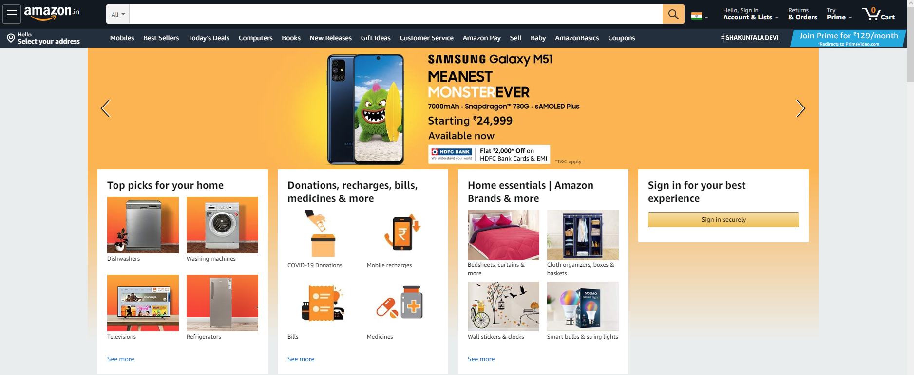

# Robo Returns
>A spy of China has been arrested from India yesterday..
>
>While he was taking to the jail he some how ran away..
>
>We have his photo but his name is not being known by any of the person..
>
>From our sources, we have come to know that the name of the person is in this webpage...
>
>You are a CBI agent and you have to find the name..
>
>http://web.hac-security.com/


Visiting this site we are welcomed to a clone of the amazon webpage, unfortunately signed out so no info there.



After a bit of prodding around I checked robots.txt, another very common place for ctf's to hide some useful info.
```
User-agent: *
Disallow: */s?k=*&rh=n*p_*p_*p_
Disallow: /dp/product-availability/
Disallow: /dp/rate-this-item/
Disallow: /exec/obidos/account-access-login
Disallow:/exec/obidos/hac-sec/johnwick/admin-login/
User-agent: AmazonAdBot
Disallow:*
```
Just from looking at this it doesn't take long to notice **johnwick**'s name right there.

`HACSEC{johnwick}`
